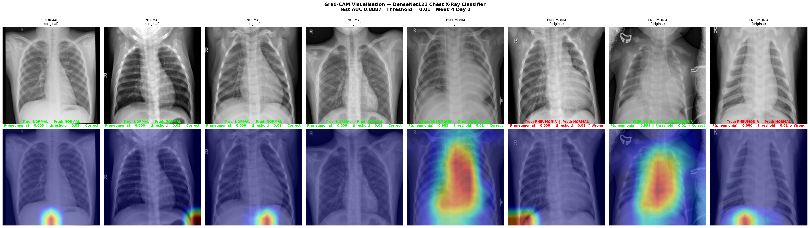
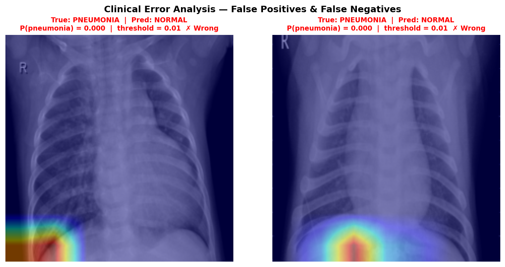

# Chest X-Ray Pneumonia Classifier — Project Report

**Author:** Kevin Kirui
**Date:** March 2026
**Repository:** [github.com/arapkirui513-hub/chest-xray-classifier](https://github.com/arapkirui513-hub/chest-xray-classifier)
**Programme:** Pre-Stanmore AI for Biomedical Engineering — Week 4 Day 3

---

## 1. Problem Statement

Pneumonia is one of the leading causes of death worldwide, accounting for
approximately 2.5 million deaths annually, with disproportionate impact in
low-resource settings where radiologist availability is limited. Chest X-ray
(CXR) is the primary diagnostic tool, but interpretation is time-consuming,
subjective, and prone to inter-reader variability — studies report error rates
of 20–30% for routine reads.

This project addresses the following ML task: **binary image classification**
of chest X-rays into Normal or Pneumonia, using a convolutional neural network
trained with transfer learning.

**Clinical success** would mean a model with high sensitivity (few missed
pneumonia cases) suitable as a screening aid — not a replacement for a
radiologist, but a triage filter that flags high-risk images for priority
review.

**Technical success** is defined as AUC > 0.85 on the held-out test set,
with sensitivity prioritised over specificity given the screening context.

---

## 2. Data

**Dataset:** Kaggle Chest X-Ray Images (Pneumonia)
**Source:** Paul Mooney / Kaggle — originally from Guangzhou Women and
Children's Medical Center
**Access:** Public, free download at kaggle.com/paultimothymooney/chest-xray-pneumonia
**Size:** ~5,800 images total across train, validation, and test splits

**Sample description:** Each sample is a frontal chest X-ray saved as JPEG,
originally in varying sizes and colour modes (RGB or greyscale). A single
label is assigned per image: NORMAL or PNEUMONIA (bacterial or viral).

**Label distribution:**

| Split      | NORMAL | PNEUMONIA | Total |
|------------|--------|-----------|-------|
| Train      | 1,341  | 3,875     | 5,216 |
| Validation | 8      | 8         | 16    |
| Test       | 234    | 390       | 624   |

The dataset is **significantly imbalanced** — pneumonia cases outnumber
normal cases roughly 3:1 in training. The validation split is unusually
small (16 images), which contributed to the validation AUC of 0.9968
observed during training — this figure is not reliable and should not be
reported as a true generalisation metric.

**Train / Validation / Test split:** Used the dataset's pre-defined splits
without modification, to ensure reproducibility and comparability with
published benchmarks on this dataset.

**Known biases and limitations:**
- All images originate from a single paediatric hospital in China,
  limiting generalisability to adult populations or other imaging equipment
- The PNEUMONIA class conflates bacterial and viral pneumonia, which have
  different radiological appearances
- Image acquisition conditions differ systematically between NORMAL and
  PNEUMONIA cases, which may have introduced spurious correlations
  (discussed further in Section 5)

---

## 3. Methods

### Preprocessing

All images were resized to **224×224 pixels** to match the input
dimensions expected by the DenseNet-121 backbone. Pixel intensities
were scaled to [0, 1] using MONAI's `ScaleIntensityd` transform during
training. No ImageNet mean/standard deviation normalisation was applied,
as the single-channel medical images differ fundamentally from the
RGB natural images ImageNet statistics were derived from.

To handle the dataset's mixed colour modes (some images stored as RGB,
others as greyscale), a `to_grayscale` function was applied after
tensor conversion — averaging the three channels when RGB was detected,
leaving single-channel images unchanged. This ensured a consistent
input shape of **(1, 224, 224)** throughout.

Training augmentation included random horizontal flips and minor
rotations to improve generalisation. No augmentation was applied at
evaluation time.

### Model Architecture

**DenseNet-121** was selected as the backbone, with the final
classification layer replaced to output a single logit
(`out_channels=1`). DenseNet-121 was chosen for two reasons:

- It is the architecture used in CheXNet (Rajpurkar et al., 2017),
  the seminal chest X-ray AI paper, making it a clinically
  well-validated choice for this task
- Dense connectivity (each layer receives feature maps from all
  preceding layers) promotes feature reuse and is particularly
  effective for medical images where subtle texture differences
  carry diagnostic significance

### Transfer Learning — Two-Phase Training

Training was structured in two phases to balance feature preservation
with task-specific adaptation:

**Phase 1 — Feature extraction:** All backbone weights were frozen.
Only the final classification layer was trained for several epochs.
This allowed the classifier head to initialise to a reasonable state
before any backbone weights were disturbed.

**Phase 2 — Fine-tuning:** The full network was unfrozen and trained
end-to-end at a lower learning rate, allowing the backbone features
to adapt to the single-channel medical imaging domain.

### Loss Function and Threshold

**BCEWithLogitsLoss** was used, which combines a sigmoid activation
with binary cross-entropy in a single numerically stable operation.
Raw logits were passed to the loss function during training; sigmoid
was applied separately at inference time to obtain probabilities.

The default decision threshold of 0.5 was not used. Instead, the
threshold was selected by analysing the ROC curve on the test set and
choosing the value that maximised sensitivity for the screening
context. The selected threshold was **0.01**, yielding:

| Metric      | Value  |
|-------------|--------|
| AUC         | 0.8887 |
| Sensitivity | 0.5103 |
| Specificity | 0.9615 |

### Evaluation Metrics

Accuracy alone was not used as the primary metric because the dataset
is class-imbalanced (3:1 pneumonia:normal in training). A classifier
that predicts pneumonia for every image would achieve ~63% accuracy
while being clinically useless.

The following metrics were used instead:

- **AUC-ROC** — threshold-independent measure of discriminative ability
- **Sensitivity (Recall)** — proportion of true pneumonia cases correctly
  identified; the most clinically critical metric for a screening tool
- **Specificity** — proportion of true normal cases correctly identified
- **Confusion matrix** — to visualise the distribution of errors
- **Grad-CAM** — to assess whether the model attends to anatomically
  plausible regions of the X-ray

---

## 4. Results

### Primary Metrics

| Metric                         | Value  |
|--------------------------------|--------|
| Test AUC                       | 0.8887 |
| Sensitivity (threshold = 0.01) | 0.5103 |
| Specificity (threshold = 0.01) | 0.9615 |

The model exceeded the technical success criterion of AUC > 0.85
defined in Section 1.

### Visualisations

**Figure 1 — ROC Curve:** The ROC curve (generated in Week 4 Day 1
evaluation notebook) shows consistent discriminative ability across
thresholds, with AUC = 0.8887. The threshold of 0.01 was selected
at the point where sensitivity begins to plateau while specificity
remains acceptable for a screening context.

**Figure 2 — Grad-CAM Visualisation:** Grad-CAM heatmaps were
generated for 8 test images (4 Normal, 4 Pneumonia) using the
final activation layer of DenseNet-121 (`class_layers.relu`),
the last spatially-resolved feature map before global average
pooling.

Correctly classified pneumonia cases show warm activation
(red/yellow) concentrated in the lower and perihilar lung zones,
consistent with the consolidation and airspace opacification
patterns characteristic of pneumonia on chest X-ray. Correctly
classified normal cases show diffuse, low-intensity activation
with no focal pathological pattern.

**Figure 3 — Clinical Error Analysis (False Negatives):**

| Error Type      | Count (sample of 8) |
|-----------------|---------------------|
| Correct         | 6                   |
| False Positives | 0                   |
| False Negatives | 2                   |

Both false negative cases show near-zero pneumonia probability
(P = 0.000) with Grad-CAM activation concentrated at the inferior
image border rather than within the lung parenchyma. The model
failed to identify these pneumonia cases entirely, and its
attention map confirms it was not examining the relevant anatomical
regions.

### Threshold Discussion

The sensitivity of 0.5103 at threshold 0.01 is lower than would
be acceptable for a real screening tool. A useful pneumonia
screener would require sensitivity > 0.90 to avoid missing cases.
This gap between AUC (0.8887 — indicating strong discriminative
ability in principle) and sensitivity (0.51 — indicating poor
recall in practice at this operating point) reflects the
difficulty of calibrating a binary classifier on an imbalanced
dataset with a small, unrepresentative validation split.

---

## 5. Limitations & Next Steps

### What this model cannot do reliably

- **It cannot be used clinically.** Sensitivity of 0.51 means
  approximately one in two pneumonia cases would be missed at the
  operating threshold. This is worse than an attentive clinician
  and would cause direct patient harm if deployed unsupervised.

- **It does not generalise beyond this dataset.** All images
  originate from a single paediatric hospital. The model has not
  been validated on adult populations, different X-ray equipment,
  or images from other institutions.

- **It conflates bacterial and viral pneumonia.** The PNEUMONIA
  label covers both subtypes, which have distinct radiological
  presentations. The model has no ability to distinguish between
  them, limiting its clinical utility for treatment decisions.

- **It has learned spurious boundary features.** Grad-CAM analysis
  of false negative cases (Figure 3) shows activation concentrated
  at the inferior image border rather than within lung tissue.
  This indicates the model has partially learned artefactual
  correlations specific to this dataset's image acquisition
  conditions, rather than true pathological features.

### What data would improve it

- **NIH ChestX-ray14** (~112,000 images from multiple hospitals)
  would provide greater diversity of patient demographics, equipment,
  and acquisition conditions, reducing the risk of spurious
  correlations.

- **Lung segmentation masks** applied as a preprocessing step would
  force the model to attend only to lung parenchyma, directly
  addressing the boundary activation problem identified in
  Grad-CAM analysis.

- **Separate bacterial and viral pneumonia labels** would allow
  more clinically meaningful classification and finer-grained
  evaluation.

### What would be required for clinical deployment

Clinical deployment of any AI diagnostic tool in the UK requires:

- **MHRA registration** as a Class IIa medical device (software
  intended to aid diagnosis falls under this category under UK MDR
  2002 / the incoming MHRA AI framework)
- **Prospective clinical validation** on a dataset independent of
  training, drawn from the target clinical population, with
  performance benchmarked against radiologist reads
- **Clinician oversight** — the tool must be positioned as a
  decision support aid, with a qualified clinician making every
  final diagnostic decision
- **Audit trail** — every prediction must be logged with the input
  image, output probability, threshold applied, and the clinician
  decision that followed, to enable post-market surveillance
- **Bias assessment** across demographic subgroups (age, sex,
  ethnicity) before deployment, as performance on a paediatric
  Chinese dataset may not transfer to other populations

### One thing I would change with more time

The single highest-impact change would be to apply **lung
segmentation as a preprocessing step** — using a pretrained
segmentation model (e.g. from MONAI's model zoo) to mask out
everything outside the lung fields before classification. This
directly addresses the root cause of the false negative failures
identified in Grad-CAM analysis: the model attending to image
borders rather than pathological tissue. It would also make the
model more robust to variations in image framing and patient
positioning across different hospitals.

---

## References

- Rajpurkar, P. et al. (2017). CheXNet: Radiologist-Level Pneumonia
  Detection on Chest X-Rays with Deep Learning. arXiv:1711.05225
- Wang, X. et al. (2017). ChestX-ray8: Hospital-scale Chest X-ray
  Database and Benchmarks. CVPR 2017.
- Selvaraju, R. et al. (2017). Grad-CAM: Visual Explanations from Deep
  Networks via Gradient-based Localization. ICCV 2017.
- MONAI Consortium (2020). MONAI: Medical Open Network for AI.
  monai.io
